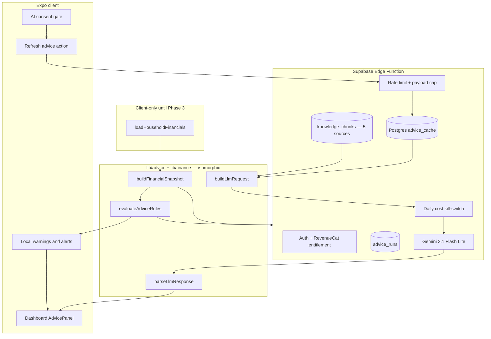

# Beaverr — AI Household Advice Integration Plan

> **Purpose:** Living specification for personalized household financial **narrative** advice via an external LLM API. Intended for review and revision by humans and other AI tools.
>
> **Status:** Draft — provider + infra locked; Phase 1 not implemented in app UI  
> **Last updated:** 2026-06-24  
> **Related:** `docs/AI-CLOUD-SETUP-COOKBOOK.md`, `docs/beaverr-project-plan.md`, `docs/eval-fixture-spec.md`, `docs/ARCHITECTURE.md`, `PRODUCT.md`, `lib/insights.js`, `lib/householdBudget.js`, `lib/dashboardAlerts.js`

---

## Decisions locked (2026-06-24)

| Area | Decision |
|------|----------|
| **LLM provider** | **Google Gemini `gemini-3.1-flash-lite`** — eval-approved (`npm run advice:eval`, 2026-06-24 all PASS). **Dev/eval:** Google AI Studio API. **Production EU:** Google Cloud Gemini API in EU region + Google Cloud DPA (not AI Studio consumer terms alone) |
| **Premium gating** | **LLM narrative is premium-only** (RevenueCat). Free tier: local rule warnings + static disclaimer + `advice.healthy` — no API calls |
| **Infrastructure** | **Supabase from the start** — Edge Function `advice-generate` + Postgres `advice_cache` / `advice_runs`. No interim Vercel + Upstash trial stack |
| **KB scope (v1)** | **5 curated sources** — human-reviewed; link via rule `source_refs`; expand after Phase 4 validation |
| **Eval qualitative** | **LLM-as-judge** (same Gemini model, separate rubric call) — implemented in `lib/advice/__evals__/assertions/qualitative.js`; periodic human CS spot-check for Q4 |
| **DeepSeek hosted API** | **Ruled out for EU users** unless/until a documented enterprise DPA exists |
| **DeepSeek self-host** | Optional Phase 4+ cost path (MIT V4-Flash weights on EU infra) — not Phase 2 |
| **Empty `triggered_rules`** | **Skip LLM** — static i18n (`advice.healthy`); no "all clear" narration |
| **`fix_ratio`** | `(fixed_m + debt_m) / income_m` — matches `lib/insights.js` `fixedCostRatio` |
| **Tier 4 debt detail** | **Opaque refs only** (`ref: "debt_1"`) — no user-typed labels in prompts |
| **Prompt payload** | **Enum ids + numbers only** — never free-text the user typed (stash names, creditors, custom labels) |
| **Prompt version** | **`v3`** — coach system prompt; output `{ paragraphs: string[] }`; no citations in model output |
| **AI consent** | **Separate toggle** (`beaverr_ai_consent`) — name **Google** as subprocessor in EN/CS copy |
| **Cache + rate limits** | Postgres `advice_cache` + Edge middleware; per-user/per-IP limits from Phase 2 |
| **Rate limits** | Ship with advice endpoint (not deferred to Phase 5) |
| **Output validation** | `parseLlmResponse.js`: schema + citation subset + numeric fidelity (see §8) |
| **Cost kill-switch** | `ADVICE_DAILY_BUDGET_USD` env |
| **Eval harness** | M1–M9 mechanical = hard gate; qualitative via LLM judge — `docs/eval-fixture-spec.md`, `npm run advice:eval` |
| **Client/server shared code** | Pure `lib/advice/*` + `lib/finance.js`; aggregation client-only until server DB adapter (see §4) |

---

## Remaining to finalize (plan owner)

| # | Item | Notes |
|---|------|-------|
| **1** | **AI consent copy (EN/CS)** | Name Google (Gemini API); describe snapshot data sent |
| **2** | **Rule thresholds (first 5–10)** | Sourced heuristics for CZ — `docs/advice-sources.md` (5 sources) |
| **3** | **GCP Gemini EU setup** | GCP project, EU region, DPA, production API key — before public launch |
| **4** | **Output language override** | Always match app locale, or user setting later? |
| **5** | **Gemini API pricing refresh** | Re-verify §7.4 before production deploy |
| **6** | **`beaverr-project-plan.md` sync** | AI Features section → Gemini + Supabase + premium |

---

## Table of contents

1. [Goals and non-goals](#1-goals-and-non-goals)
2. [Core principles](#2-core-principles)
3. [High-level architecture](#3-high-level-architecture)
4. [Separation of concerns](#4-separation-of-concerns)
5. [Data snapshot (LLM input)](#5-data-snapshot-llm-input)
6. [Knowledge base and rule catalog](#6-knowledge-base-and-rule-catalog)
7. [LLM provider strategy](#7-llm-provider-strategy)
8. [Request pipeline and modules](#8-request-pipeline-and-modules)
9. [Token estimation and cost tracking](#9-token-estimation-and-cost-tracking)
10. [Caching](#10-caching)
11. [UI and i18n](#11-ui-and-i18n)
12. [Infrastructure phasing (Supabase-first)](#12-infrastructure-phasing-supabase-first)
13. [Database schema (when Supabase exists)](#13-database-schema-when-supabase-exists)
14. [Security, privacy, and compliance](#14-security-privacy-and-compliance)
15. [Implementation phases](#15-implementation-phases)
16. [Open questions for reviewers](#16-open-questions-for-reviewers)
17. [File index (planned)](#17-file-index-planned)
18. [Revision log](#18-revision-log)

---

## 1. Goals and non-goals

### Goals

- Provide **short, personalized textual advice** based on household data the user already entered in Beaverr (income, expenses, categories, debts, goals, etc.).
- Keep per-user cost **very low** via compact prompts, caching, and event-driven regeneration (not on every page view).
- Support **EN and CS** (formal “vy” in Czech), aligned with `PRODUCT.md`.
- Ground advice in **curated domain knowledge** (books, reputable guides, reviewed summaries) — not LLM-invented financial folklore.
- Keep **critical warnings deterministic** (local rule engine + existing alert pipeline).
- Log **token usage and estimated cost** per advice run for monitoring and pricing.

### Non-goals (this phase)

- Licensed investment advice, stock/crypto picks, or product sales recommendations.
- Training or fine-tuning a custom foundation model.
- Replacing Beaverr’s financial math (`lib/finance.js`, `lib/householdBudget.js`).
- Open banking / automated transaction import.
- Real-time chat with unbounded conversation history.

---

## 2. Core principles

| Principle | Implication |
|-----------|-------------|
| **Math is local** | All amounts, ratios, and flags are computed in `lib/` before any LLM call. |
| **Warnings are local** | Deficits, overcommitment, high APR, renewals, etc. use `computeInsights()` + `dashboardAlerts` — never LLM. |
| **LLM narrates only** | **Gemini** explains **triggered rules** using provided facts only — **premium subscribers** with AI consent |
| **No LLM when nothing to narrate** | Empty `triggered_rules` → static i18n, no API call. |
| **No invented heuristics in prompts** | Thresholds live in a **rule catalog** with `source_refs` to curated materials. |
| **No user free-text in prompts** | Only app-defined category ids, enum roles, opaque refs, and numbers — never `customLabel`, creditor names, stash names. |
| **Disclaimer is static** | Legal “not professional advice” copy comes from `en.json` / `cs.json`, not from the model. |
| **API keys server-side only** | Never embed provider keys in the Expo client bundle. |
| **Compact JSON in, structured JSON out** | Minimize tokens; validate response shape and factual fidelity. |
| **EU GDPR by default** | CZ/EU households; subprocessors must have DPA; household finances are personal data even when pseudonymized. |

---

## 3. High-level architecture



**Request flow (production target):**

1. User opens Insights or taps “Refresh personalized explanation.”
2. Client shows **local warnings** immediately (no LLM).
3. If **no rules triggered** → show `advice.healthy` (static i18n); **stop**.
4. If rules triggered, user is **premium** (RevenueCat), and **`beaverr_ai_consent` accepted** → client calls Supabase Edge Function.
5. Server verifies **entitlement** + rate limit + payload cap; checks **Postgres `advice_cache`** by `snapshot_hash` + `locale` + `model` + `prompt_version`.
6. On miss: check **daily cost budget**; assemble prompt (`buildLlmRequest` v2); call **Gemini**; run **`parseLlmResponse`**; store cache + `advice_runs` row.
7. Client renders narrative + **fixed disclaimer**.

**Early build:** client may send `{ snapshot, triggered_rules, locale }` until household data lives in Postgres; server still enforces premium + AI consent + rate limits.

**Dev/eval:** Google Cloud Vertex Gemini (`location=eu`, `aiplatform.eu.rep.googleapis.com`) via ADC — `npm run advice:eval`. Legacy AI Studio `GEMINI_API_KEY` still works with a deprecation warning.

**Production:** Same Vertex EU multi-region endpoint; Edge Function uses **GCP service account JSON** (`GCP_SERVICE_ACCOUNT_JSON` secret), not API keys.

---

## 4. Separation of concerns

| Layer | Responsibility | Existing code to extend |
|-------|----------------|-------------------------|
| **Aggregation** | Normalize user data to monthly figures | `lib/householdBudget.js` → `HouseholdFinancials` |
| **Insight engine** | Ratios, flags, section signals | `lib/insights.js` → `computeInsights()` |
| **Alert queue** | Actionable dashboard alerts | `lib/dashboardAlerts.js`, `lib/alerts.js` |
| **Risk exposure** | Non-monthly liabilities (e.g. TPL) | `lib/householdRisks.js` |
| **Advice rules** | Expandable catalog with citations | **New:** `lib/advice/rules/` |
| **Snapshot builder** | Compact JSON for LLM | **New:** `lib/advice/buildFinancialSnapshot.js` |
| **LLM orchestration** | Prompt, call, parse, log | **New:** server handler + `lib/advice/buildLlmRequest.js` |
| **UI** | Warnings + narrative + disclaimer + AI consent | **New:** `AdvicePanel` |

**Phase 4 comment in `lib/insights.js`:** `getSectionInsight` is rule-based today; AI replaces **narrative enrichment**, not warning detection.

### Client/server shared code boundary

`lib/` today mixes **pure business logic** with **client-only I/O** (`getData`, `t()` display names). The advice pipeline must not duplicate financial math.

| Module | Runs on client | Runs on server | Notes |
|--------|----------------|----------------|-------|
| `lib/finance.js` | ✓ | ✓ | Pure — shared |
| `lib/advice/buildFinancialSnapshot.js` | ✓ | ✓ (Phase 3+) | Pure input: normalized snapshot-shaped object, not raw storage |
| `lib/advice/evaluateAdviceRules.js` | ✓ | ✓ | Pure — shared |
| `lib/advice/buildLlmRequest.js` | — | ✓ | Server only (Bearer / service account) |
| `lib/advice/parseLlmResponse.js` | ✓ | ✓ | Shared — client may validate cached responses |
| `lib/householdBudget.js` → `loadHouseholdFinancials` | ✓ | Phase 3 adapter | Imports storage + i18n — **not** imported by Edge Function as-is |

**Phase 1–2:** Client runs `loadHouseholdFinancials` → `buildFinancialSnapshot` → `evaluateAdviceRules`; sends result to server for LLM only when rules fired.

**Phase 3:** Server loads household rows from Postgres, maps to the **same snapshot shape** via a thin `server/advice/loadSnapshotFromDb.js` adapter — reuses `buildFinancialSnapshot` / `evaluateAdviceRules`, does not fork `toMonthly` or ratio logic.

---

## 5. Data snapshot (LLM input)

### Format: compact JSON (not Markdown)

Use **short keys**, no pretty-print, monthly-normalized amounts via `toMonthly()`.

**Why JSON over Markdown tables:** fewer tokens, reliable parsing, stable schema for tests.

### Key formulas (must match `lib/insights.js`)

| Field | Formula |
|-------|---------|
| `fix_ratio` | `(fixed_m + debt_m) / income_m` when `income_m > 0` |
| `surplus_m` | `income_m - fixed_m - debt_m - flex_m` (aligned with insight surplus semantics) |

Example: `fixed_m: 52000`, `debt_m: 8000`, `income_m: 85000` → `fix_ratio: 0.71`.

### Tier 1 — Always include

```json
{
  "v": 1,
  "locale": "cs",
  "household": { "adults": 2, "children": 1, "has_partner": true },
  "ledger": {
    "currency": "CZK",
    "income_m": 85000,
    "income_sources": [
      { "role": "user", "m": 60000 },
      { "role": "partner", "m": 25000 }
    ],
    "fixed_m": 52000,
    "debt_m": 8000,
    "flex_m": 25000,
    "surplus_m": -5000,
    "fix_ratio": 0.71
  }
}
```

### Tier 2 — Category rollups

- Per category: `id`, `m` (monthly), `pct` (of income), `item_count`
- Top 3–5 categories by amount (already similar to `insights.topCategories`)
- **Ids only** — no user-facing category labels in the prompt

### Tier 3 — Triggered rules only (from rule engine)

Pass **only rules that fired**, with stable ids and computed facts:

```json
{
  "triggered_rules": [
    {
      "id": "fixed_cost_ratio_tight",
      "severity": "warning",
      "facts": { "fix_ratio": 0.71, "threshold": 0.80 }
    }
  ]
}
```

Do **not** ask the LLM to re-derive these booleans.

**If `triggered_rules` is empty:** do not call the LLM.

### Tier 4 — Conditional detail

Include line-item detail **only** when a related rule triggered. Cap list lengths (e.g. top 5 debts).

**Debt items — hard rule:**

```json
{ "ref": "debt_1", "type": "credit_card", "balance": 45000, "apr": 0.24, "payment_m": 4200 }
```

- `ref` is an opaque id (`debt_1`, `debt_2`) — **never** creditor names or user `customLabel`
- `type` is from app enum (`credit_card`, `loan`, `mortgage`, …)

### Exclude from LLM payload

- Real names, addresses, account numbers
- User-typed strings: stash names, subscription custom labels, utility `customLabel`, debt creditor fields
- Raw onboarding JSON / storage keys
- Duplicate raw frequencies when `*_m` monthly values exist
- Full questionnaire history

### Privacy labels

Use `user`, `partner`, `child_1`, `vehicle_1` — not PII.

### Target size

Aim for **800–1,500 input tokens** for typical households.

---

## 6. Knowledge base and rule catalog

### Problem

We must **not** embed unsupported rules in the system prompt (e.g. “3–6 months emergency fund”) unless they come from **approved sources**.

### Three layers

#### Layer A — Curated sources (offline)

- **v1 scope: 5 sources** — books, CZ/EU consumer finance guides, vetted web articles (see `docs/advice-sources.md`).
- Stored as chunks with metadata: `source_id`, `title`, `url_or_isbn`, `locale`, `topic_tags`, `excerpt` or human-reviewed summary.

#### Layer B — Rule catalog (code + citations)

Each rule is **evaluated in JavaScript**, documented with `source_refs`:

```js
// Conceptual shape — lib/advice/rules/housing.js
{
  id: 'housing_cost_share_elevated',
  category: 'housing',
  severity: 'warning',
  source_refs: ['cz_consumer_budget_guide#housing_share'],
  evaluate(snapshot) { /* pure function */ },
  messageKey: 'advice.warnings.housingHighShare', // local i18n
  includeInLlmContext: true,
}
```

**Workflow to add a rule:**

1. Select source → extract candidate heuristic → **human review**.
2. Implement `evaluate()` + `source_refs` + EN/CS `messageKey`.
3. Optionally link KB chunks for LLM context when rule fires.

#### Layer C — RAG at request time (small, Phase 4+)

When rule `id` fires, attach **0–2 KB chunks** referenced by `source_refs`.

### Expanding beyond current flags

Today `lib/insights.js` includes roughly:

- `overcommitted`, `tight` (fixed ratio > 1 / > 0.8)
- `negativeSurplus`
- `manyStreaming` (≥ 3)
- `subBudgetHeavy`
- `goalAtRisk`
- `high_apr` (APR > 20%)
- `high_share` housing (> 35% income)
- `renewals_soon`

**Planned expansions** (each requires sourced threshold before implementation):

| Rule id (proposed) | Inputs |
|--------------------|--------|
| `single_income_household` | income source count |
| `debt_payment_ratio_high` | `debt_m / income_m` |
| `savings_buffer_low` | savings vs `fixed_m` (if KB defines rule) |
| `health_coverage_gap` | `sections.health` |
| `vehicle_tpl_exposure` | `financialRisks` |
| `income_concentration` | one earner > X% of income |

---

## 7. LLM provider strategy

### Primary: Google Gemini `gemini-3.1-flash-lite`

**Status:** **Approved for implementation** after eval harness pass (2026-06-24 AI Studio; **2026-06-25 Vertex EU multi-region** — mechanical + qualitative PASS on all 3 fixtures). Run `npm run advice:eval` before every `prompt_version` change.

| Environment | API surface | Auth | Notes |
|-------------|-------------|------|-------|
| **Dev / eval** | [Vertex EU multi-region](https://docs.cloud.google.com/gemini-enterprise-agent-platform/resources/locations) | ADC (`gcloud auth application-default login`) or `GEMINI_ACCESS_TOKEN` | `npm run advice:eval`; `lib/advice/geminiClient.js` |
| **Production (EU)** | `https://aiplatform.eu.rep.googleapis.com` · `location=eu` | **Service account** JSON in Supabase Edge secrets | Google Cloud DPA; org policy blocks user API keys |

**Endpoint (locked 2026-06-25):**

```
POST https://aiplatform.eu.rep.googleapis.com/v1/projects/beaverr/locations/eu/publishers/google/models/gemini-3.1-flash-lite:generateContent
Authorization: Bearer <access_token>
```

Regional pin `europe-west4` returned 404 for this project; **EU multi-region (`eu`)** confirmed working. Processing stays in EU jurisdiction per Google’s multi-region docs. Retry `europe-west4` later if NL-only pinning is required.

**Legacy:** AI Studio (`generativelanguage.googleapis.com` + `GEMINI_API_KEY`) — rate-limited; not production path.

**Use for:** Premium narrative advice only (not local warnings; questionnaire prefill in `beaverr-project-plan.md` remains a separate decision).

**Eval evidence:** 2026-06-24 AI Studio; **2026-06-25 Vertex EU (`location=eu`)** — JSON schema reliable; CS formal "vy"; multi-rule synthesis; prompt v2 citations; ~370–480 input / ~160–210 output tokens per run.

### Constraint (locked)

Lawful GDPR processing for CZ/EU household financial data — **DPA (Art. 28)** with Google Cloud for production. Household snapshots are personal data even when pseudonymized.

### Ruled out: DeepSeek hosted cloud API (EU users)

**Do not** send EU household financial snapshots to DeepSeek’s hosted API unless/until a **documented enterprise DPA** exists.

### Fallback

Secondary provider (e.g. Mistral EU, GPT-4o-mini on Azure EU) if Gemini outage, refusal, or CS regression — must meet same GDPR bar.

### Model configuration

| Setting | Value |
|---------|--------|
| Model | `gemini-3.1-flash-lite` |
| Prompt version | `v2` (`lib/advice/constants.js`) |
| Max output tokens | 400–600 |
| Temperature | 0.3–0.5 (0.4 in eval) |
| Response format | JSON object (`responseMimeType: application/json`) |

### Prompt constraints (system)

- Persona: Beaverr financial coach (4-part prose: Good / Concern / Action / Observation).
- Use **only** numbers and facts from the user message; never name books or frameworks.
- Optional `kb_chunks` in payload for grounding (internal only).
- Respond in `locale` field.
- Output schema:

```json
{
  "paragraphs": ["string", "string", "string", "string"]
}
```

Sparse data edge case: `{ "paragraphs": ["single 40–60 word paragraph"] }`.

### Cost estimates (order-of-magnitude — verify before deploy)

Assumptions: ~400 input + ~170 output tokens per uncached run (observed in eval); Gemini Flash Lite pricing.

| Monthly uncached runs | Est. API cost (pre-cache) | With ~50% cache hit |
|----------------------|---------------------------|---------------------|
| 1,000 | ~€0.30 | ~€0.15 |
| 10,000 | ~€3 | ~€1.50 |
| 100,000 | ~€30 | ~€15 |

Premium gating limits exposure; `ADVICE_DAILY_BUDGET_USD` is the hard safety cap.

---

## 8. Request pipeline and modules

> **Note:** “Request builder” is a **server-side module**, not a React UI component.

### Planned `lib/advice/` modules

| Module | Role |
|--------|------|
| `buildFinancialSnapshot.js` | `HouseholdFinancials` + goals → compact JSON |
| `evaluateAdviceRules.js` | Run rule catalog → `triggeredRules[]` + local warning keys |
| `buildLlmRequest.js` | System prompt + snapshot + triggered rules + optional KB chunks |
| `parseLlmResponse.js` | Validate JSON schema; **mechanical safety checks**; fail closed |
| `estimateTokens.js` | Pre-call token estimate (optional UI hint) |
| `hashSnapshot.js` | Stable `snapshot_hash` for cache |
| `advicePricing.js` | `cost_usd` from usage + model price table |

### `parseLlmResponse.js` — production checks (not schema-only)

1. Valid JSON matching output schema (M1, M2).
2. `citations_used` ⊆ ids of KB chunks actually sent (M3). Phase 2: must be `[]`.
3. Numbers in `headline`/`bullets` ⊆ numbers in snapshot + `triggered_rules.facts` (M4).
4. Reject on failure — return error to client; log run as `status: error`.

Reuse the same functions in `lib/advice/__evals__/assertions/mechanical.js` — see `docs/eval-fixture-spec.md`.

### Server endpoint

`POST /advice/generate`

**Early return (no LLM):** `triggered_rules.length === 0` → `{ skipped: true, reason: "no_rules" }`.

**MVP body (pre-Supabase, dev/staging):** `{ snapshot, triggered_rules, locale }` + AI consent header/token.

**Production body (Phase 3):** `{ locale }` + auth — server loads data from DB.

**Phase 2 guards (required):**

- **RevenueCat premium** entitlement check (server-side)
- Per-user and per-IP rate limits
- Max request body size (e.g. 16 KB)
- `ADVICE_DAILY_BUDGET_USD` kill-switch

**Response:**

```json
{
  "narrative": { "headline": "...", "bullets": ["..."] },
  "cached": true,
  "skipped": false,
  "usage": { "prompt_tokens": 0, "completion_tokens": 0, "cost_usd": 0 },
  "disclaimer_key": "advice.disclaimer"
}
```

`disclaimer_key` points to client i18n — disclaimer text is **never** from LLM.

---

## 9. Token estimation and cost tracking

### Measurement

1. **Authoritative:** API response `usage.prompt_tokens` / `completion_tokens`.
2. **Pre-estimate (optional):** tokenizer on assembled prompt string before send (for quotas / UI “~1.2k tokens”).

### Cost formula

```
cost_usd =
  (prompt_tokens / 1_000_000) * input_price_per_million +
  (completion_tokens / 1_000_000) * output_price_per_million
```

Store **model id** and **price snapshot** per run (provider prices change).

### Logging

- **Phase 2+:** `advice_runs` table in Supabase Postgres — see [Database schema](#13-database-schema-when-supabase-exists).

### Kill-switch

`ADVICE_DAILY_BUDGET_USD` — when cumulative daily `cost_usd` exceeds cap: reject new LLM calls with `503` + `advice.error.budgetExceeded`; alert operator.

---

## 10. Caching

- **Store:** Supabase Postgres `advice_cache` table (same project as Edge Function — no separate Redis)
- **Key:** `hash(snapshot) + locale + model_version + prompt_version`
- **When to invalidate:** income, costs, debts, goals, or budget policy change (same inputs as snapshot).
- **When to regenerate:** user taps Refresh; monthly review job (future); onboarding complete (once) — only if rules triggered.
- **Do not regenerate:** every dashboard mount; empty `triggered_rules`.

---

## 11. UI and i18n

### Layout

```
┌─────────────────────────────────────┐
│ Local warnings (rule engine)        │  ← always if triggered
├─────────────────────────────────────┤
│ AI personalized explanation         │  ← premium + rules fired + AI consent
│   headline + bullets                │
├─────────────────────────────────────┤
│ Static disclaimer (i18n)            │  ← never from LLM
└─────────────────────────────────────┘
```

When no rules fired: show `advice.healthy` instead of AI block.

### AI consent (separate from onboarding)

- **Storage key:** `beaverr_ai_consent` (distinct from `beaverr_consent`)
- **Gate:** No `POST /advice/generate` without explicit opt-in
- **Copy must:** name **Google** (Gemini API) as subprocessor; describe financial snapshot sent (no names); link to privacy policy
- **Revoke:** disables future LLM calls; does not delete local budget data

Onboarding consent (`onboarding.consent.body`) covers local GDPR processing only — it does **not** cover third-party AI.

### i18n keys to add (examples)

- `advice.disclaimer` — not professional/legal/investment advice
- `advice.healthy` — static copy when no rules triggered (no LLM)
- `advice.consent.*` — AI-specific consent screen / toggle
- `advice.warnings.*` — one per rule `messageKey`
- `advice.refresh` / `advice.loading` / `advice.error` / `advice.error.budgetExceeded`
- `advice.empty` — when LLM skipped (no AI consent / premium / offline)
- `advice.premiumRequired` — upsell for non-premium users

Wire via `useI18n()` per project rules.

### CTA mapping

Map `focus_area` / existing `getHeadlineAction()` routes (`budget`, `costs`, `debts`, etc.).

---

## 12. Infrastructure phasing (Supabase-first)

| Phase | Infrastructure | What works |
|-------|----------------|------------|
| **1** | Client + `lib/` only | Snapshot builder, rule catalog, local warnings in UI |
| **2** | **Supabase** Edge Function + Postgres | Gemini, `advice_cache` / `advice_runs`, premium gate, rate limits, kill-switch |
| **3** | Supabase Auth + RLS + household rows | Server builds snapshot from DB; client stops sending full finances |
| **4** | `knowledge_chunks` (**5 sources**) + optional `pgvector` | KB citations; M3 citation checks |

**No interim stack:** Do not use Vercel + Upstash for trials — Supabase from first LLM endpoint.

**Early caveat:** Client-sent snapshots OK until household data is in Postgres.

---

## 13. Database schema (Supabase Postgres)

```sql
-- advice_runs: audit + cost tracking
create table advice_runs (
  id uuid primary key default gen_random_uuid(),
  user_id uuid references auth.users not null,
  household_id uuid, -- when households table exists
  snapshot_hash text not null,
  model text not null,
  prompt_version text not null,
  locale text not null,
  prompt_tokens int not null default 0,
  completion_tokens int not null default 0,
  total_tokens int generated always as (prompt_tokens + completion_tokens) stored,
  cost_usd_micros bigint not null default 0, -- usd * 1e6
  rule_ids jsonb not null default '[]',
  kb_chunk_ids jsonb not null default '[]',
  status text not null check (status in ('ok', 'error', 'cached', 'skipped')),
  error_message text,
  created_at timestamptz not null default now()
);

-- advice_cache: latest narrative per snapshot (per user)
create table advice_cache (
  user_id uuid not null references auth.users (id) on delete cascade,
  snapshot_hash text not null,
  locale text not null,
  model text not null,
  prompt_version text not null,
  narrative jsonb not null,
  run_id uuid references advice_runs (id) on delete set null,
  created_at timestamptz not null default now(),
  primary key (user_id, snapshot_hash, locale, model, prompt_version)
);

-- knowledge_chunks (optional Phase 4)
create table knowledge_chunks (
  id text primary key,
  source_id text not null,
  locale text not null,
  topic_tags text[] not null default '{}',
  excerpt text not null,
  metadata jsonb not null default '{}'
);
```

Enable **RLS** so users read only their own `advice_runs` / cached rows.

Rate-limit counters may use Postgres rows or Edge-compatible KV in the same Supabase project if needed.

---

## 14. Security, privacy, and compliance

| Control | Phase | Detail |
|---------|-------|--------|
| **Subprocessor** | 2+ | **Google (Gemini API EU)** in privacy policy + AI consent |
| **DeepSeek hosted API** | — | **Blocked for EU** until enterprise DPA |
| **AI consent** | 2+ | Separate `beaverr_ai_consent`; names Google |
| **Premium gate** | 2+ | RevenueCat entitlement — server enforces before Gemini call |
| **Minimize PII in prompts** | 1+ | Enum ids + numbers only; no user free-text |
| **Prompt injection** | 1+ | Never pass `customLabel`, creditor names, stash names into LLM context |
| **Output validation** | 2+ | `parseLlmResponse` schema + citation + numeric checks |
| **Rate limits** | **2** | Per-IP + per-device; payload cap — not deferred |
| **Cost kill-switch** | **2** | `ADVICE_DAILY_BUDGET_USD` |
| **Regulatory framing** | 1+ | Informational household budgeting; static disclaimer EN/CS |

---

## 15. Implementation phases

### Phase 1 — Local intelligence (no LLM)

- [ ] `lib/advice/buildFinancialSnapshot.js`
- [ ] `lib/advice/evaluateAdviceRules.js` + initial rule catalog with `source_refs`
- [ ] Extend UI to show rule-based warnings + static disclaimer + `advice.healthy` when no rules
- [ ] Unit tests on snapshot + rules (golden household fixtures)
- [ ] Document first 5–10 rules with curated source bibliography (`docs/advice-sources.md` — optional)

**Exit criteria:** Dashboard shows richer local warnings; no API spend.

### Phase 2 — LLM narrative (Supabase + Gemini)

- [x] `lib/advice/buildLlmRequest.js` + `parseLlmResponse.js` (prompt v2; M1–M4 checks)
- [x] Eval harness + `npm run advice:eval` — Gemini 3.1 Flash Lite PASS 2026-06-24
- [x] Supabase Edge Function `advice-generate` — Vertex EU + `GCP_SERVICE_ACCOUNT_JSON` secret (not API key)
- [x] Postgres `advice_cache` + `advice_runs` + RLS (migration `20260624180000_advice_tables.sql`, eu-west-1)
- [ ] **RevenueCat premium** gate (server-side) + **AI consent** UI (`beaverr_ai_consent`, names Google)
- [ ] Rate limits + payload cap + `ADVICE_DAILY_BUDGET_USD`
- [ ] Skip LLM when `triggered_rules` empty
- [ ] UI: premium “Personalized explanation” block + Refresh
- [ ] EN/CS few-shot examples in prompt (optional polish)

**Exit criteria:** End-to-end advice for premium test users; eval green on prompt changes; Google Cloud Gemini API EU path documented for launch.

### Phase 2b — Coach chat + country official KB (2026-06-30)

- [x] `advice-chat` Edge Function — multi-turn Vertex Gemini, plain-text replies
- [x] Postgres `advice_threads` / `advice_messages` / `advice_chat_runs` + RLS
- [x] `CoachChatDrawer` + “Ask about this” on `TabInsightCard` (same gates as insight card: auth + AI consent)
- [x] Czech official resource pack (`docs/knowledge-country-cz.md`, `countryKnowledgeChunks.js`, router)
- [x] `location.country_code` on advice snapshots for country routing
- [ ] **RevenueCat premium** — deferred; hook point documented in `advice-chat` for future `premium_required`
- [ ] Seed country chunks into Postgres `knowledge_chunks` (optional; static JS registry ships in v1)

**Exit criteria:** Signed-in user with consent can ask follow-ups on any tab insight; CZ users see official source links when country chunks match.

### Phase 3 — Server-side household data

- [ ] Auth + household data in Postgres
- [ ] Server builds snapshot from DB via adapter (shared `lib/advice/*`)
- [ ] Client does not send full finances in production

**Exit criteria:** Production-ready data boundary.

### Phase 4 — Knowledge base (5 sources)

- [ ] Ingest **5 curated sources** → `knowledge_chunks`
- [ ] Link chunks to rule `source_refs` in `docs/advice-sources.md`
- [ ] Attach 0–2 chunks per triggered rule; enable M3 citation checks
- [ ] Optional: `pgvector` retrieval

**Exit criteria:** Narrative cites only approved `source_id`s in `citations_used`.

### Phase 5 — Product hardening

- [ ] Fallback provider (Mistral EU / GPT-4o-mini Azure)
- [ ] Admin dashboard for cost per MAU
- [ ] Abuse monitoring beyond basic rate limits

---

## 16. Open questions for reviewers

**Resolved** — see [Decisions locked](#decisions-locked-2026-06-24). Do not re-open without new legal or product input.

**Still open** — see [Remaining to finalize](#remaining-to-finalize-plan-owner). Priority:

1. **AI consent copy (EN/CS)** — name Google (Gemini API)
2. **First CZ rule thresholds** + **5 KB sources** bibliography
3. **Google Cloud Gemini API EU** production setup before public launch
4. **Sync `beaverr-project-plan.md`** AI section

---

## 17. File index (planned)

```
lib/
  advice/
    buildFinancialSnapshot.js
    evaluateAdviceRules.js
    geminiClient.js
    buildLlmRequest.js
    parseLlmResponse.js
    estimateTokens.js
    hashSnapshot.js
    advicePricing.js
    __evals__/                    # see docs/eval-fixture-spec.md
      fixtures/
      assertions/
      runEvals.js
      reports/
    rules/
      index.js
      housing.js
      debt.js
      income.js
      ...
  insights.js              # extend, do not replace warnings
  householdBudget.js         # snapshot source (client Phase 1-2)
  dashboardAlerts.js         # critical alerts unchanged
  consent.js                 # extend with beaverr_ai_consent helpers

supabase/functions/advice-generate/
  index.ts
supabase/functions/advice-chat/
  index.ts

components/dashboard/
  TabInsightCard.jsx       # insight card + Ask about this
  CoachChatDrawer.jsx      # follow-up chat
  AdviceSourceLinks.jsx    # official URL footer

lib/locales/
  en.json                    # advice.* keys
  cs.json

docs/
  AI-INTEGRATION-PLAN.md     # this file
  eval-fixture-spec.md       # LLM narration eval harness
  advice-sources.md          # optional bibliography for rules
```

---

## 18. Revision log

| Date | Author | Change |
|------|--------|--------|
| 2026-06-24 | Initial draft | DeepSeek V4 Flash, compact JSON snapshots, rule catalog, local warnings, token/cost logging |
| 2026-06-24 | Review pass | Blocked DeepSeek hosted API for EU; shared-code boundary; fix_ratio; empty-rules skip; AI consent; Upstash; Phase 2 rate limits + parse checks; eval harness |
| 2026-06-24 | Plan owner | EU provider left **undecided** — Mistral listed as leading candidate only; consent copy deferred until provider chosen |
| 2026-06-24 | Eval + plan owner | **Locked Gemini `gemini-3.1-flash-lite`** (eval PASS); Supabase-first; premium-only narrative; 5 KB sources; LLM qualitative judge; AI Studio dev / Google Cloud Gemini API EU prod |

---

## AI reviewer instructions

When revising this document:

1. Preserve **separation of concerns** (local math/warnings vs LLM narrative).
2. Do not re-introduce **DeepSeek hosted API** for EU users without documented DPA.
3. Flag any suggestion that moves **thresholds** into prompts without `source_refs`.
4. Flag any path that puts **user free-text** into LLM context.
5. Check alignment with `docs/ARCHITECTURE.md` and `lib/insights.js` / `lib/dashboardAlerts.js`.
6. Propose concrete rule definitions with test fixtures, not vague “AI should warn about X.”
7. Keep EN/CS and GDPR constraints explicit.
8. **Gemini `gemini-3.1-flash-lite`** is locked — do not substitute DeepSeek hosted API for EU without DPA.
