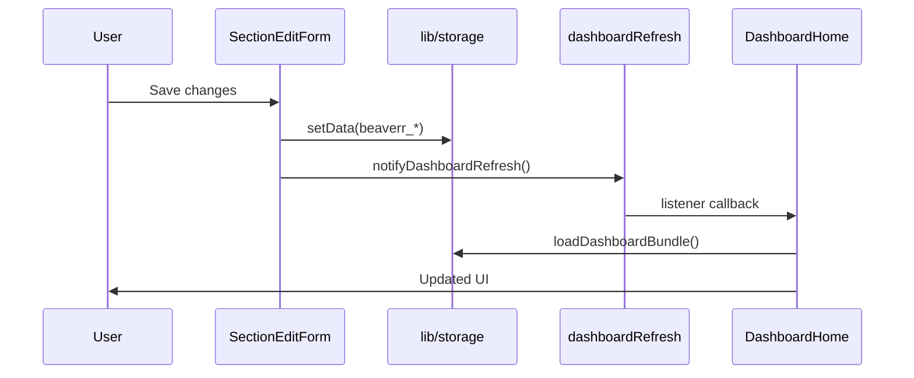

# Beaverr — Architecture & Internal Implementation Guide

> **Purpose:** Hand this document to an AI (or human) reviewer for architecture critique, security review, refactor planning, or feature scoping. It describes how Beaverr is built, how layers communicate, and what constraints reviewers must respect.
>
> **Last updated:** 2026-06-23  
> **Repo:** `beaverr` (household financial clarity app)  
> **Related docs:** `PRODUCT.md`, `DESIGN.md`, `AGENTS.md`, `docs/pre-alpha-review.md`

---

## Table of contents

1. [Executive summary](#1-executive-summary)
2. [Tech stack](#2-tech-stack)
3. [High-level architecture](#3-high-level-architecture)
4. [Application bootstrap](#4-application-bootstrap)
5. [Routing & navigation](#5-routing--navigation)
6. [Data layer](#6-data-layer)
7. [Business logic (`lib/`)](#7-business-logic-lib)
8. [Component architecture](#8-component-architecture)
9. [How components talk to each other](#9-how-components-talk-to-each-other)
10. [State management](#10-state-management)
11. [Internationalization (i18n)](#11-internationalization-i18n)
12. [Theming & design system](#12-theming--design-system)
13. [Key user flows](#13-key-user-flows)
14. [Dashboard data pipeline](#14-dashboard-data-pipeline)
15. [Onboarding system](#15-onboarding-system)
16. [Financial calculations](#16-financial-calculations)
17. [Goals, cycles, and jars](#17-goals-cycles-and-jars)
18. [Section editing (post-onboarding)](#18-section-editing-post-onboarding)
19. [Testing strategy](#19-testing-strategy)
20. [Platform targets & storage limitations](#20-platform-targets--storage-limitations)
21. [Security, privacy & consent](#21-security-privacy--consent)
22. [Migrations & legacy naming](#22-migrations--legacy-naming)
23. [Extension points](#23-extension-points)
24. [Known gaps & tech debt](#24-known-gaps--tech-debt)
25. [Conventions & naming](#25-conventions--naming)
26. [Anti-patterns to avoid](#26-anti-patterns-to-avoid)
27. [AI review checklist](#27-ai-review-checklist)
28. [Critical file index](#28-critical-file-index)

---

## 1. Executive summary

Beaverr is a **local-first household budgeting app** for English and Czech users. It walks households through a structured questionnaire (income, housing, transport, health, children, pets, subscriptions, debts, flexible budget rules) and surfaces ongoing clarity in a sidebar-based app shell.

**Architectural stance (Phase 1):**

| Principle | Implementation |
|-----------|----------------|
| **Thin routes, fat logic** | `app/**/*.jsx` screens delegate to `components/` and `lib/` |
| **Storage as source of truth** | No Redux/Zustand; persistence via `getData`/`setData` |
| **Pure business logic** | Financial math, navigation helpers, migrations live in testable `lib/` modules |
| **Locale parity** | Every user-facing string in `en.json` + `cs.json` via `useI18n()` |
| **Schema as documentation** | `lib/schema.js` JSDoc typedefs — no runtime validation library |

**North star (product + design):** *"The Household Ledger"* — calm navy-on-paper finance UI, one decision per onboarding screen, numbers over decoration. See `PRODUCT.md` and `DESIGN.md`.

---

## 2. Tech stack

| Layer | Choice | Version notes |
|-------|--------|---------------|
| Framework | Expo SDK | ~56.0.8 |
| Routing | Expo Router | ~56.2.8, file-based, typed routes enabled |
| UI runtime | React Native + react-native-web | RN 0.85.3, React 19.2.3 |
| Styling | NativeWind v4 + Tailwind | `className` on RN primitives |
| Component kit | gluestack-ui themed | Partial adoption; custom primitives in `components/ui/` |
| Animation | Reanimated 4.x | Pay-cycle borders, crossfades, layout |
| SVG | react-native-svg | Illustrations, icons, charts |
| Persistence | Custom `lib/storage.js` | Web: `localStorage`; native: **in-memory only** |
| Testing | Jest + @react-native/jest-preset | ~70 test files, logic-heavy |
| Export | xlsx, xlsx-js-style, expo-print/sharing | Budget export |
| Language | JavaScript (`.js`/`.jsx`) | TypeScript used for types/env only |

**Entry point:** `package.json` → `"main": "expo-router/entry"`

---

## 3. High-level architecture

```
┌─────────────────────────────────────────────────────────────────────────┐
│                         app/_layout.jsx                                  │
│   Fonts → ThemeProvider → I18nProvider → Root Stack                      │
└─────────────────────────────────────────────────────────────────────────┘
                                    │
            ┌───────────────────────┼───────────────────────┐
            ▼                       ▼                       ▼
     app/index.jsx          (onboarding)/            (app)/
     boot redirect           questionnaire            dashboard shell
            │                       │                       │
            │                       ▼                       ▼
            │              components/onboarding/   components/dashboard/
            │              + lib/onboarding*        + components/app/
            │                       │                       │
            └───────────────────────┴───────────────────────┘
                                    │
                                    ▼
                          ┌─────────────────┐
                          │   lib/storage   │  ← beaverr_* keys
                          └────────┬────────┘
                                   │
          ┌────────────────────────┼────────────────────────┐
          ▼                        ▼                        ▼
   lib/householdBudget.js   lib/onboardingProgress.js   lib/goals/
   lib/finance.js           lib/onboardingNavigation.js lib/budgetCycle.js
   lib/dashboardData.js     lib/schema.js (shapes)      lib/dailyLog.js
```

**Layer responsibilities:**

| Layer | Owns | Must not own |
|-------|------|--------------|
| `app/` | Route registration, layout shells, boot guards | Business math, storage key strings scattered inline |
| `components/` | Presentation, form UX, animations | Direct financial aggregation |
| `lib/` | Persistence orchestration, calculations, navigation history | JSX rendering (except theme/i18n providers) |
| `constants/` | Design tokens, boot loader HTML, showcase data | User data |
| `lib/locales/` | Copy | Logic |

---

## 4. Application bootstrap

### 4.1 Root layout (`app/_layout.jsx`)

1. Load General Sans fonts via `expo-font`
2. Wrap app in `ThemeProvider` (gluestack config + `C` color tokens)
3. Wrap in `I18nProvider` (loads locale from `beaverr_settings`)
4. Render root `Stack` with three children: `index`, `(onboarding)`, `(app)`

### 4.2 Boot router (`app/index.jsx`)

On mount:

1. `ensureStorageMigrated()` — legacy `pocketos_*` → `beaverr_*`, step field aliases
2. Read `beaverr_onboarding` via `getOnboardingState()`
3. **Redirect logic:**
   - If `isDashboardUnlocked` → dashboard OR resume incomplete questionnaire at `resumeRoute`
   - Else → `/(onboarding)/welcome`
4. Shows `AppLoadingScreen` during check; errors default to welcome

### 4.3 Web-specific boot (`app/+html.jsx`)

Static HTML includes an inline boot loader (`BOOT_LOADER` from `constants/boot-loader.js`). `ThemeProvider` calls `hideWebBootLoader()` after theme is ready to fade it out.

---

## 5. Routing & navigation

### 5.1 Route groups

| Group | Path prefix | Layout file | Purpose |
|-------|-------------|-------------|---------|
| Root | `/` | `app/_layout.jsx` | Boot only |
| Onboarding | `/(onboarding)/` | `app/(onboarding)/_layout.jsx` | ~48 questionnaire screens |
| App shell | `/(app)/` | `app/(app)/_layout.jsx` | Sidebar + tabs + nested stacks |

**Naming conventions (onboarding):**

- `splash-<section>.jsx` — intro/splash before a form section
- `<section>.jsx` — data entry form
- `review-edit/` — nested stack for editing from review screen

### 5.2 App shell layout (`app/(app)/_layout.jsx`)

- **Wide breakpoint:** 768px — sidebar persistent vs mobile drawer
- **Components:** `AppSidebar`, `AppTopNavBar`, `QuestionnaireBanner`
- **Guard:** `useEffect` on `segments` — if user in quick-setup and visits a locked tab → `router.replace('/(app)/dashboard')`
- **Stack animation:** fade, 220ms

### 5.3 Nested stacks

| Stack | Routes | Notes |
|-------|--------|-------|
| Goals | `goals/index`, `goals/[goalId]` | Dynamic goal detail |
| Savings | `savings/index`, `savings/[stashId]` | Custom stash detail |
| Section edit | `edit/[section]` | Transparent modal overlays |
| Review edit | `review-edit/income`, `review-edit/expenses`, `review-edit/section/[id]` | Onboarding review corrections |

### 5.4 Navigation guards summary

| Guard | Trigger | Action |
|-------|---------|--------|
| Boot redirect | `app/index.jsx` | Dashboard vs welcome vs resume |
| Quick-setup tab lock | `(app)/_layout.jsx` | Locked tabs → dashboard |
| Consent resume | `consent.jsx` | Branch by onboarding flags |
| Welcome resume | `welcome.jsx` | Restore nav history if dashboard unlocked but questionnaire incomplete |
| Edit fallback | `edit/[section].jsx` | Unknown section → dashboard |

**Locked tabs during quick setup** (`QUICK_LOCKED_TAB_ROUTES` in `lib/onboardingProgress.js`):

`costs`, `budget`, `goals`, `savings`, `summary`, `alerts`

### 5.5 Onboarding navigation history

Onboarding uses `router.replace()` heavily (no back stack from Expo Router). Custom history in `lib/onboardingNavigation.js`:

- Module-level `memoryHistory` + `currentEntry`
- Persisted to `beaverr_onboarding.navHistory`
- `navigateForward()` / `navigateBack()` — history-aware
- `ONBOARDING_BACK_FALLBACK` — static fallback map when history is incomplete
- `useOnboardingScreen()` hook — registers screen on focus, handles Android hardware back

**Important:** App tabs use `navigateAppTab()` from `lib/screenTransition.js` for consistent fade transitions.

---

## 6. Data layer

### 6.1 Storage API (`lib/storage.js`)

```javascript
getData(key)    // JSON parse; null on miss/error
setData(key, value)  // JSON stringify; throws on write error
removeData(key)
clearAllData()  // all registered keys + legacy aliases
ensureStorageMigrated()
```

**Platform adapters:**

| Platform | Backend | Persistence |
|----------|---------|-------------|
| Web | `localStorage` | Survives refresh |
| iOS/Android | In-memory object | **Lost on app restart** |

### 6.2 Storage key registry (`lib/beaverrConstants.js`)

All keys use `beaverr_*` prefix. Legacy `pocketos_*` aliased via `resolveStorageKey()`.

| Key constant | Storage key | Domain |
|--------------|-------------|--------|
| `consent` | `beaverr_consent` | GDPR-style consent record |
| `onboarding` | `beaverr_onboarding` | Progress flags, nav history, resume route |
| `household` | `beaverr_household` | Household type, children, names |
| `location` | `beaverr_location` | Country, city, currency, citizenship |
| `occupation` | `beaverr_occupation` | Employment types |
| `income` | `beaverr_income` | Income sources, savings, goals |
| `housing` | `beaverr_housing` | Rent/mortgage, utilities |
| `transport` | `beaverr_transport` | Vehicles, public transport |
| `health` | `beaverr_health` | Insurance members |
| `childrenCosts` | `beaverr_children_costs` | Per-child costs |
| `pets` | `beaverr_pets` | Pet expenses |
| `subscriptions` | `beaverr_subscriptions` | Recurring subscriptions |
| `otherCosts` | `beaverr_other_costs` | Miscellaneous |
| `debts` | `beaverr_debts` | Loans, cards, BNPL |
| `budget` | `beaverr_budget` | Flexible budget, rollover, jars, cycles |
| `dailyLog` | `beaverr_daily_log` | Daily spend entries |
| `budgetCycles` | `beaverr_budget_cycles` | Pay-cycle store |
| `cycleAdjustments` | `beaverr_cycle_adjustments` | Mid-cycle budget changes |
| `obligations` | `beaverr_obligations` | External overspend coverage |
| `alerts` | `beaverr_alerts` | Reminder/alert records |
| `goals` | `beaverr_goals` | Savings/debt payoff goals |
| `goalsMigrated` | `beaverr_goals_migrated` | One-time migration flag |
| `reminderPrefs` | `beaverr_reminder_prefs` | Reminder scheduling prefs |
| `settings` | `beaverr_settings` | Language, etc. |
| `uiPreferences` | `beaverr_ui_preferences` | Sidebar collapsed, visited |
| `questionnaireSnapshot` | `beaverr_questionnaire_snapshot` | Retake backup |
| `quickSetupSnapshot` | `beaverr_quick_setup_snapshot` | Quick setup backup |
| `storageMigrated` | `beaverr_storage_migrated` | Migration completion flag |

**Key groupings** (`lib/onboardingDataKeys.js`):

- `QUESTIONNAIRE_DATA_KEYS` — 14 profile/budget keys for full questionnaire
- `QUICK_SETUP_DATA_KEYS` — household, location, occupation, housing only

### 6.3 Schema (`lib/schema.js`)

Single source of truth for data shapes — **JSDoc `@typedef` only**, no Zod/Yup/runtime validation.

Major types: `Household`, `Location`, `Occupation`, `Income`, `Housing`, `Transport`, `HealthInsurance`, `ChildrenCosts`, `Pets`, `Subscriptions`, `OtherCosts`, `Debts`, `Budget`, `CustomStash`, `DailyLog`, `BudgetCycle`, `Goal`, `OnboardingState`, `Settings`, `Alert`, `Consent`.

**Reviewer note:** Adding a new persisted field requires updating `schema.js`, the save module, any aggregation in `householdBudget.js`, and both locale files if UI-facing.

### 6.4 Onboarding state shape (`OnboardingState`)

Key flags reviewers should know:

| Field | Meaning |
|-------|---------|
| `completed` | Full questionnaire submitted |
| `dashboardUnlocked` | User can access app shell (quick setup sets this) |
| `questionnaireComplete` | All sections done |
| `questionnaireEverCompleted` | Retake eligibility |
| `setupMode` | `'full'` \| `'quick'` |
| `percentComplete` | Progress bar (quick = 25%) |
| `resumeRoute` | Deep link to continue questionnaire |
| `navHistory` | Serialized onboarding navigation stack |
| `currentStep` / `stepsByRoute` | Per-route sub-step tracking |

`patchOnboardingState()` merges patches and runs `repairOnboardingState()` to fix flags lost when section saves replaced the full object.

---

## 7. Business logic (`lib/`)

Organized by domain. **All financial math must go through `lib/finance.js`** — never duplicate `toMonthly` in screens.

### 7.1 Finance & aggregation

| Module | Responsibility |
|--------|----------------|
| `finance.js` | `toMonthly`, `formatCurrency`, `availableBudget`, `dailyAllowance`, `debtPayoff`, `effectiveSpendingBudget` |
| `householdBudget.js` | `loadHouseholdFinancials()` — aggregates all sections into `HouseholdFinancials` |
| `householdCosts.js` | Income/cost line computation |
| `budgetSplit.js` | Spending vs savings ratio from flexible budget |
| `costReductionProgress.js` | Committed baseline for "reduce costs" feature |
| `wasteTax.js` | CZ waste tax estimation |
| `budgetMigration.js` | Policy migrations on budget load |
| `budgetExport.js` | XLSX export |

### 7.2 Pay cycles

| Module | Responsibility |
|--------|----------------|
| `budgetCycle.js` | Cycle store load/save, active cycle |
| `cycleStart.js`, `cycleClose.js`, `cycleEdit.js` | Lifecycle |
| `cycleAdjustments.js`, `obligations.js` | Mid-cycle changes, external coverage |
| `cyclePace.js`, `cycleJar.js`, `cycleDayLedger.js` | Pace tracking, jars, daily ledger |
| `cycleCalendarGrid.js`, `cyclePoolBreakdown.js` | UI helpers |
| `overspendCoverage.js` | How overspend is covered |

### 7.3 Month-end & daily jars

| Module | Responsibility |
|--------|----------------|
| `monthEndRouting.js` | Calendar month-end processing |
| `jarRouting.js` | Day-end jar routing (rollover strategies) |
| `dailyLog.js` | Daily spend log persistence |
| `customStashes.js`, `stashTransfers.js`, `stashMovements.js` | Savings stash ledger |

### 7.4 Goals (`lib/goals/`)

| Module | Responsibility |
|--------|----------------|
| `index.js` | `processGoalsPipeline()` — orchestrates migration, sync, funding, alerts |
| `goalCrud.js`, `goalStorage.js` | CRUD + persistence |
| `goalSync.js`, `goalsMigration.js` | Debt/income linkage |
| `goalFunding.js`, `goalFundingSchedule.js` | Scheduled funding moves |
| `goalPace.js`, `goalProgress.js` | Pace/status |
| `goalAlerts.js` | Alert generation |

### 7.5 Onboarding

| Module | Responsibility |
|--------|----------------|
| `onboardingProgress.js` | Flags, gating, `patchOnboardingState` |
| `onboardingNavigation.js` | History stack, forward/back |
| `onboardingStepRegistry.js` | Per-route steps, storage keys |
| `onboardingResume.js`, `onboardingExit.js` | Resume/retake/snapshot |
| `finishOnboardingSection.js` | Section completion helper |
| `*OnboardingSave.js` | Per-section save (household, occupation, income, budget) |
| `citizenshipFlow.js`, `transport/transportFlow.js`, `income/incomeFlow.js`, `housing/housingFlow.js` | Domain multi-step flows |

### 7.6 Dashboard

| Module | Responsibility |
|--------|----------------|
| `dashboardData.js` | `loadDashboardBundle()` — master orchestrator |
| `dashboardRefresh.js` | Pub/sub: `subscribeDashboardRefresh` / `notifyDashboardRefresh` |
| `insights.js`, `aiInsights.js` | Insight text generation |
| `alerts.js`, `reminderPreferences.js`, `reminderSchedule.js` | Reminders |
| `dashboardAlerts.js` | Action queue for dashboard home |

### 7.7 Section editing

| Module | Responsibility |
|--------|----------------|
| `sectionEditRegistry.js` | Section ID → edit form component map |
| `sectionEditPaths.js` | Route paths for `/(app)/edit/[section]` |
| `sectionEditStorage.js` | Load/save helpers for edit forms |
| `inlineIncomeSave.js`, `inlineExpenseSave.js` | Dashboard inline panel saves |

### 7.8 Review

| Module | Responsibility |
|--------|----------------|
| `reviewOnboardingData.js` | Review screen data builders |
| `review/reviewSections.js`, `review/reviewFinancials.js`, `review/reviewFormatters.js` | Formatting |
| `reviewUiState.js`, `reviewRowEdit.js`, `reviewEditNavigation.js` | Review-edit flow |

---

## 8. Component architecture

### 8.1 Folder map

| Folder | Role | Key components |
|--------|------|----------------|
| `components/app/` | App shell | `AppSidebar`, `AppTopNavBar`, `QuestionnaireBanner`, `ScreenTransitionShell`, `LucideStrokeIcon` |
| `components/onboarding/` | Questionnaire UI | `QuestionScreen`, `SplashScreen`, `OnboardingBottomBar`, `LabeledInput`, `FrequencyPills`, `*Illustration.jsx` |
| `components/onboarding/review/` | Review cards | `ReviewSectionCard`, `ReviewSummaryBar` |
| `components/dashboard/` | Tab content | `DashboardHome`, `BudgetContent`, `GoalsContent`, `TrackerContent`, `ExpensesContent` |
| `components/dashboard/cycles/` | Pay-cycle UI | `CycleCalendar`, `CloseCycleWizard`, `SpendLogSheet` |
| `components/section-edit/` | Modal edits | `SectionEditForm`, `forms/*Edit.jsx` |
| `components/ui/` | Shared primitives | `FormInput`, `PrimaryButton`, `OutlineButton`, `ConfirmDialog`, `OptionCard`, `SurfaceCard` |

### 8.2 Screen thinness pattern

Route files are **thin shells**:

```javascript
// app/(app)/dashboard.jsx — typical pattern
export default function DashboardScreen() {
  return (
    <DashboardErrorBoundary>
      <ScreenTransitionShell variant="dashboard">
        <DashboardHome />
      </ScreenTransitionShell>
    </DashboardErrorBoundary>
  );
}
```

Onboarding screens wrap content in `QuestionScreen` + `useOnboardingLayout()` for responsive layout.

### 8.3 Icons

Custom Lucide stroke paths in `components/app/lucidePaths.js`, rendered via `LucideStrokeIcon.jsx` — not `@expo/vector-icons` for primary nav.

---

## 9. How components talk to each other

There is **no global app store**. Communication happens through:

### 9.1 Persistence (primary)

```
Screen/Component
    │  user action
    ▼
setData('beaverr_<section>', payload)
patchOnboardingState({ ... })
    │
    ▼
notifyDashboardRefresh()  ← if dashboard-visible data changed
    │
    ▼
Other screens reload via getData on focus OR refresh subscription
```

### 9.2 Dashboard refresh pub/sub

`lib/dashboardRefresh.js`:

- `subscribeDashboardRefresh(listener)` — `DashboardHome`, tab contents register
- `notifyDashboardRefresh()` — called after saves in section edits, goals, cycles, onboarding completion

**Callers include:** `finishOnboardingSection.js`, `GoalsContent.jsx`, `LocationEdit.jsx`, `CycleControlSection.jsx`, `quick-setup.jsx`, review submit, etc.

### 9.3 React Context (scoped UI state)

| Context | File | Used for |
|---------|------|----------|
| `I18nContext` | `lib/i18n.js` | `t()`, `locale`, `setLocale` |
| `ThemeProvider` | `lib/theme/ThemeProvider.jsx` | Colors, gluestack config |
| `SectionEditProvider` | `lib/SectionEditContext.jsx` | Modal close/saved callbacks |
| `SectionEditFocusContext` | `lib/SectionEditFocusContext.jsx` | Focus in edit forms |
| `DashboardScrollContext` | `lib/dashboardScroll.js` | Scroll coordination |
| `OnboardingScrollContext` | `lib/onboardingScroll.js` | Onboarding scroll |
| `OnboardingValidationClearContext` | `lib/onboardingValidationClear.js` | Clear errors on nav |
| `DropdownElevateContext` | `components/onboarding/InputGroup.jsx` | Dropdown z-index |

### 9.4 Router / URL params

- Dynamic routes: `[goalId]`, `[stashId]`, `[section]`
- Search params via `useLocalSearchParams()` in onboarding multi-step screens
- `router.push` / `router.replace` for navigation; prefer `navigateForward` in onboarding

### 9.5 Props drilling (local)

Dashboard tab contents receive loaded `bundle` or reload independently. Parent-child within a feature (e.g. `PayCycleCard` → `SpendLogSheet`) uses standard React props.

### 9.6 Data flow diagram (dashboard edit)



---

## 10. State management

| Pattern | Where | When to use |
|---------|-------|-------------|
| `useState` / `useCallback` | Screens, forms | Ephemeral UI (loading, validation, expand/collapse) |
| `getData` / `setData` | All persisted data | Source of truth |
| Context | Providers listed above | Cross-cutting UI (theme, i18n, edit modal) |
| Module-level memory | `onboardingNavigation.js` | Nav history (also persisted) |
| Pub/sub | `dashboardRefresh.js` | Invalidate dashboard without prop drilling |
| `useFocusEffect` | Onboarding screens | Reload on screen focus |

**Not used:** Redux, Zustand, React Query, MobX.

---

## 11. Internationalization (i18n)

| File | Role |
|------|------|
| `lib/i18n.js` | `I18nProvider`, `useI18n()` hook |
| `lib/translateCore.js` | Pure `translate(locale, key, params)` — no React imports (testable) |
| `lib/locales/en.json` | English |
| `lib/locales/cs.json` | Czech (formal "vy" tone) |

**Mechanics:**

- Nested dot keys: `dashboard.title`, `onboarding.welcome.heading`
- Interpolation: `{{param}}` in strings
- Locale from `beaverr_settings.language` on boot
- Missing keys: warn once, return key string
- Top-level namespaces: `app`, `common`, `onboarding`, `dashboard`, `sectionEdit`, `settings`

**Mandatory rule:** Any new user-facing text requires keys in **both** `en.json` and `cs.json` in the same PR. No hardcoded JSX strings.

---

## 12. Theming & design system

**Canonical tokens:** `constants/onboarding-theme.js`

| Export | Contents |
|--------|----------|
| `C` | Color tokens (bg, surface, primary, accent, positive, danger, …) |
| `S` | Spacing (pagePadH, cardPad, …) |
| `T` | Typography presets (display, headline, title, body, helper, …) |
| `R` | Border radii |

`lib/theme/ThemeProvider.jsx` applies `applyActiveTheme()` for light/dark and syncs gluestack config.

**Styling approach:**

- NativeWind `className` where configured
- Inline `style={{ ...T.body, color: C.text }}` common in dashboard/onboarding
- gluestack `Text`/`Button` in some areas

**Design constraints (from `PRODUCT.md` / `DESIGN.md`):**

- Navy-on-paper ledger aesthetic; restrained blue accent
- No gamification, glassmorphism, gradient marketing tropes
- WCAG 2.1 AA target; `accessibilityLabel` on icon-only controls
- `useReducedMotion()` / `prefers-reduced-motion` for animations

---

## 13. Key user flows

### 13.1 Cold start

```
app/index.jsx
  → ensureStorageMigrated()
  → isDashboardUnlocked?
      No  → /(onboarding)/welcome
      Yes → isQuestionnaireComplete?
              No + resumeRoute → restoreNavHistory → resume onboarding
              Yes → /(app)/dashboard
```

### 13.2 Full onboarding

1. `welcome` → `consent` → `setup-mode` (choose full vs quick)
2. Section order: household → location/citizenship/permit → occupation → income → strategy → housing → transport → health → children → pets → subscriptions → other-costs → debts → budget-setup → budget-rollover → budget-spending-strategy → review
3. Each section: splash → form → save to `beaverr_*` + `patchOnboardingState`
4. `review.jsx` submit: sets `completed`, `questionnaireComplete`, snapshots baseline, `router.replace('/(app)/dashboard')`, `notifyDashboardRefresh()`

### 13.3 Quick setup

1. `setup-mode` → `quick-setup` (minimal fields)
2. Writes: household, location, occupation, housing, income, budget
3. Sets `dashboardUnlocked: true`, `setupMode: 'quick'`, `percentComplete: 25`
4. Dashboard accessible; locked tabs redirect; `QuestionnaireBanner` prompts continue
5. Resume at `QUICK_RESUME_ROUTE` = `/(onboarding)/splash-income`

### 13.4 Retake questionnaire

- `onboardingExit.js`: `snapshotQuestionnaireForRetake()` before clearing
- Entry: `QUESTIONNAIRE_WELCOME_ROUTE` = `/(onboarding)/welcome`
- Shown when `shouldShowRetakeQuestionnaire()` — prior full submit, not mid-continue

---

## 14. Dashboard data pipeline

`loadDashboardBundle(t)` in `lib/dashboardData.js` is the **single orchestration point** for dashboard screens.

**Pipeline order:**

1. `loadHouseholdFinancials(t)` — aggregate income, costs, debts, flexible budget
2. `migrateBudgetPolicy()` — apply budget schema migrations; persist if changed
3. `processGoalsPipeline()` — goals migration, sync with debts/income, funding, alerts; may persist goals/budget/income/debts
4. `computeInsights()` — textual insights from financials + goals
5. `ensureCommittedBaseline()` — cost reduction baseline
6. Compute `effectiveMonthlyFlexible` (optional savings goal deduction)
7. **Branch:** cycles enabled?
   - No → `ensureMonthEndProcessed()` (calendar month-end)
   - Yes → `syncBudgetActiveCycleId()`, load cycle store
8. `loadDailyLogs()`, `loadCycleAdjustments()`, `loadOpenObligations()`
9. `processDayEndIfNeeded()` — jar routing for closed days; persist budget/income if days closed
10. `syncAlerts()` — merge goal alerts, reminders
11. Return `{ financials, insights, alerts, goals, cycles, ... }`

**Consumer pattern (`DashboardHome.jsx`):**

```javascript
const load = useCallback(async () => {
  const data = await loadDashboardBundle(t);
  setBundle(data);
}, [t]);

useEffect(() => subscribeDashboardRefresh(load), [load]);
```

---

## 15. Onboarding system

### 15.1 Step registry (`lib/onboardingStepRegistry.js`)

Maps each route to:

- Sub-steps (for multi-step forms within one screen)
- Associated storage key
- Resume builder functions

### 15.2 Save pattern (typical section)

1. User completes form
2. `setData('beaverr_<section>', payload)` — shape per `schema.js`
3. `patchOnboardingState({ currentStep, percentComplete, resumeRoute, ... })`
4. `navigateForward('/(onboarding)/next-route')`
5. Optionally `notifyDashboardRefresh()` if data affects dashboard preview

### 15.3 Multi-step within one screen

`useOnboardingMultiStep.js` — sub-step state; `useOnboardingProgress.js` — monotonic progress bar; domain flows in `*Flow.js` modules (citizenship, transport, income, housing).

### 15.4 Review & review-edit

- `review.jsx` — read-only summary from `reviewOnboardingData.js`
- `review-edit/` — nested stack; edits persist immediately to storage keys

---

## 16. Financial calculations

**All calculations live in `lib/finance.js` and callers.** Key formulas:

### 16.1 Frequency conversion (`toMonthly`)

| Frequency | Multiplier |
|-----------|------------|
| daily | × 30.44 |
| weekly | × 4.33 |
| fortnightly | × 2.17 |
| monthly | × 1 |
| quarterly | × 1/3 |
| annual | × 1/12 |

### 16.2 Core aggregates (`householdBudget.js`)

```
totalIncome     = sum of all income sources (toMonthly each)
fixedCosts      = housing + transport + health + children + pets + subs + other (toMonthly)
debtPayments    = sum of min payments
availableBudget = totalIncome - fixedCosts - debtPayments  (via finance.availableBudget)
monthlyFlexible = user-defined flexible spending (from budget section)
effectiveMonthlyFlexible = monthlyFlexible - savingsGoalDeduction (if enabled)
```

### 16.3 Display frequencies

`dailyAllowance`, `weeklyAllowance`, `displayBudget` — convert monthly flexible to user's `budgetDisplayFrequency` (daily/weekly/monthly).

### 16.4 Money parsing

`parseMoneyAmount()` — handles `"1 500,00"` European format and plain numbers.

**Reviewer rule:** Never add `amount * 12` inline in a screen — use `toMonthly(amount, 'annual')`.

---

## 17. Goals, cycles, and jars

### 17.1 Goals pipeline

On every dashboard load, `processGoalsPipeline()`:

1. `migrateGoalsIfNeeded()` — one-time schema migration
2. `syncGoalsWithSources()` — link goals to debts/income
3. `processGoalFundingIfDue()` — move money on schedule
4. `finalizeGoalStates()` — mark completed, celebrations
5. `scanGoalAlerts()` — generate alert records
6. Persist any changed goals/budget/income/debts

### 17.2 Pay cycles (optional mode)

When `budget.cyclesEnabled === true`:

- Budget is managed per pay cycle, not calendar month
- `budgetCycle.js` stores cycle history; `cycleStart`/`cycleClose` manage lifecycle
- UI in `components/dashboard/cycles/`

### 17.3 Jars & rollover

`budget.rolloverStrategy`: `'free'` | `'capped'` | `'reset'`

- Month-end: `monthEndRouting.js`
- Day-end: `jarRouting.js` processes daily logs, updates rollover/loose money/stash balances
- Custom stashes: `customStashes.js`, savings tab

---

## 18. Section editing (post-onboarding)

**Route:** `/(app)/edit/[section]` — transparent modal stack

**Registry:** `lib/sectionEditRegistry.js` maps section IDs to form components:

`household`, `location`, `income`, `housing`, `transport`, `health`, `childrenCosts`, `pets`, `subscriptions`, `other-costs`, `debts`, `budget`

**Flow:**

1. User taps edit (sidebar, dashboard card, `EditSectionButton`)
2. `router.push(sectionEditPath(sectionId))`
3. `SectionEditForm` loads from storage via `sectionEditStorage.js`
4. Save → `setData` → `notifyDashboardRefresh()` → close modal

**Inline edits:** Dashboard panels (`IncomeItemEditPanel`, expense panels) use `inlineIncomeSave.js` / `inlineExpenseSave.js` without full modal.

---

## 19. Testing strategy

| Config | Value |
|--------|-------|
| Runner | Jest 29 + `@react-native/jest-preset` |
| Location | `__tests__/**/*.test.[jt]s?(x)` |
| Setup | `jest.setup.js` mocks `expo-router` |
| Coverage target | `lib/**`, `components/**` (configured, not enforced in CI) |

**Heavily tested:** `lib/finance.js`, cycles, goals, onboarding navigation, storage migration, household budget, alerts, stash movements, i18n translate core.

**Lightly tested:** React components (few component tests; e.g. `useInsightTextExpansion.test.js`).

**Pattern for new logic:** Add pure functions in `lib/`, unit test in `__tests__/lib/`. Mock storage in tests where needed.

**Run:** `npm test` / `npm run test:watch`

---

## 20. Platform targets & storage limitations

From `app.json`:

| Platform | Notes |
|----------|-------|
| iOS | Portrait, tablet support |
| Android | Adaptive icon; `predictiveBackGestureEnabled: false` |
| Web | Metro bundler, **static output**, scheme `beaverr` |

### Critical limitation

**Native persistence is in-memory only.** Data is lost when the app process ends. Web uses `localStorage` and is fully persistent.

**Implication for reviewers:** Any feature assuming durable native storage is broken until AsyncStorage/SQLite is wired. Tests and web builds behave differently from native builds.

---

## 21. Security, privacy & consent

| Aspect | Current state |
|--------|---------------|
| Data location | 100% local (browser storage or app memory) |
| Backend / API | None in Phase 1 |
| Auth | None |
| Consent | `beaverr_consent` — `consent.jsx` gate before setup |
| Data export | User-initiated XLSX via `budgetExport.js` |
| Data wipe | `clearAllData()` on consent revoke / retake flows |

**No encryption at rest.** Web data is visible in DevTools.localStorage.

**Reviewer focus:** PII (names, income, debts) sits in plain JSON locally. Future sync would need encryption, consent updates, and schema versioning.

---

## 22. Migrations & legacy naming

| Migration | Module |
|-----------|--------|
| `pocketos_*` → `beaverr_*` | `lib/beaverrStorageMigration.js` |
| Onboarding step field aliases | `lib/onboardingStepAliases.js` |
| Goals schema | `lib/goals/goalsMigration.js` |
| Budget policy | `lib/budgetMigration.js` |
| Subscriptions catalog | `lib/subscriptionMigration.js` |

Brand rename: codebase was "PocketOS"; storage keys migrated but some docs/comments may still say PocketOS.

`ensureStorageMigrated()` runs before every `getData`/`setData`.

---

## 23. Extension points

Safe places to extend without architectural churn:

| Extension | Where to hook |
|-----------|---------------|
| New onboarding section | Add route in `(onboarding)/_layout.jsx`, splash + form screens, `onboardingStepRegistry`, `schema.js`, save module, `householdBudget.js` aggregation, locales |
| New app tab | Route in `(app)/`, `AppSidebar` nav item, `appTabLabels.js`, locales |
| New section edit | Form in `components/section-edit/forms/`, entry in `sectionEditRegistry.js`, `sectionEditPaths.js` |
| New storage key | `beaverrConstants.js` STORAGE_KEYS + ALL_CLEARABLE_STORAGE_KEYS, `schema.js`, migration if needed |
| New financial metric | `lib/finance.js` or `householdBudget.js`, test in `__tests__/lib/` |
| New alert type | `lib/alerts.js`, reminder modules |
| New goal type | `lib/goals/` pipeline stages |

---

## 24. Known gaps & tech debt

Items an AI reviewer should flag or account for:

| Gap | Severity | Notes |
|-----|----------|-------|
| Native storage in-memory | **High** | Data loss on native app restart |
| No runtime schema validation | Medium | JSDoc only; bad data can corrupt UI |
| Onboarding nav history complexity | Medium | Custom stack + fallbacks; edge cases on resume |
| Component test coverage low | Medium | Regressions caught late in UI |
| Accessibility hardening | Medium | PRODUCT.md notes sidebar/focus/contrast gaps |
| CZ-specific expense gaps | Product | See `docs/pre-alpha-review.md` |
| `childrenCosts` vs `children-costs` route naming | Low | Layout registers camelCase; file is kebab-case |
| Mixed styling (NativeWind + inline + gluestack) | Low | Consistency ongoing |
| No state machine for onboarding | Low | Consider XState if flows grow (noted in pre-alpha review) |
| AI insights | Low | `aiInsights.js` — template/heuristic, not LLM API |

---

## 25. Conventions & naming

| Area | Convention |
|------|------------|
| Routes | kebab-case filenames: `children-costs.jsx`, `budget-setup.jsx` |
| Route groups | `(app)`, `(onboarding)` — parentheses exclude from URL |
| Dynamic routes | `[section].jsx`, `[goalId].jsx`, `[stashId].jsx` |
| lib modules | camelCase `.js`; subfolders by domain |
| Components | PascalCase `.jsx`; feature folders |
| Storage keys | `beaverr_*`; use `STORAGE_KEYS` constant |
| Exports | Named exports in `lib/`; default export for screen components |
| Saves | Always `patchOnboardingState` after section save; don't replace full onboarding object without merge |
| Dashboard invalidation | Call `notifyDashboardRefresh()` after any save affecting dashboard data |
| i18n keys | dot-separated; mirror path in `en.json` and `cs.json` |
| Finance | Never duplicate `toMonthly` — import from `lib/finance.js` |
| CHANGELOG | Append line to `CHANGELOG.md` on every change (CEST/CET) |

---

## 26. Anti-patterns to avoid

1. **Hardcoded UI strings** — always `t('key')`
2. **Financial math in JSX** — belongs in `lib/finance.js` / `householdBudget.js`
3. **`router.push` in onboarding forward nav** — use `navigateForward()` to maintain history
4. **Replacing full `beaverr_onboarding` object** — use `patchOnboardingState()` or lose flags
5. **New storage keys without `ALL_CLEARABLE_STORAGE_KEYS`** — breaks `clearAllData()`
6. **Direct `localStorage` access** — use `getData`/`setData`
7. **Skipping `notifyDashboardRefresh`** after edits — stale dashboard
8. **Generic fintech/marketing UI** — violates brand anti-references in `PRODUCT.md`
9. **English-only locale keys** — breaks Czech parity rule
10. **Assuming native persistence** — test on web; native loses data on restart

---

## 27. AI review checklist

Use this when reviewing code, architecture, or proposing changes:

### Architecture
- [ ] Does new logic live in `lib/` rather than route files?
- [ ] Is storage accessed only via `getData`/`setData`?
- [ ] Are new keys registered in `beaverrConstants.js` and `schema.js`?
- [ ] Does dashboard data flow through `loadDashboardBundle` or a justified subset?
- [ ] Are saves followed by `notifyDashboardRefresh()` when needed?

### Onboarding
- [ ] Is `patchOnboardingState` used (not full object replace)?
- [ ] Is route registered in `(onboarding)/_layout.jsx`?
- [ ] Is step in `onboardingStepRegistry.js`?
- [ ] Does forward nav use `navigateForward`?
- [ ] Is resume route updated on section complete?

### Finance
- [ ] All amounts normalized with `toMonthly` / `parseMoneyAmount`?
- [ ] Aggregates go through `householdBudget.js`?
- [ ] Unit tests added for new calculations?

### i18n & a11y
- [ ] EN + CS keys added?
- [ ] `accessibilityLabel` on icon-only controls?
- [ ] Reduced motion respected for animations?

### Platform
- [ ] Works if storage returns null (first launch)?
- [ ] Native in-memory limitation documented if feature needs persistence?
- [ ] Web static export constraints considered?

### Brand & UX
- [ ] Aligns with "Household Ledger" aesthetic?
- [ ] One primary decision per onboarding screen?
- [ ] Numbers visible; decoration restrained?

### Testing
- [ ] Pure logic has `__tests__/lib/` coverage?
- [ ] `npm test` passes?

---

## 28. Critical file index

| Concern | Path |
|---------|------|
| Root layout | `app/_layout.jsx` |
| Boot router | `app/index.jsx` |
| App shell + tab guard | `app/(app)/_layout.jsx` |
| Onboarding stack | `app/(onboarding)/_layout.jsx` |
| Storage API | `lib/storage.js` |
| Key registry | `lib/beaverrConstants.js` |
| Data shapes | `lib/schema.js` |
| Onboarding state | `lib/onboardingProgress.js` |
| Nav history | `lib/onboardingNavigation.js` |
| Dashboard orchestrator | `lib/dashboardData.js` |
| Dashboard refresh | `lib/dashboardRefresh.js` |
| Financial aggregation | `lib/householdBudget.js` |
| Finance math | `lib/finance.js` |
| Goals pipeline | `lib/goals/index.js` |
| Pay cycles | `lib/budgetCycle.js` |
| i18n | `lib/i18n.js`, `lib/translateCore.js`, `lib/locales/` |
| Theme | `lib/theme/ThemeProvider.jsx`, `constants/onboarding-theme.js` |
| Section edit registry | `lib/sectionEditRegistry.js` |
| Product spec | `PRODUCT.md` |
| Design spec | `DESIGN.md` |
| Agent rules | `AGENTS.md`, `.cursor/skills/` |
| Pre-alpha product review | `docs/pre-alpha-review.md` |
| Jest config | `jest.config.js` |

---

## Appendix A — Complete app route list

### `(app)` routes
`dashboard`, `income`, `costs`, `budget`, `tracker`, `summary`, `alerts`, `profile`, `account-settings`, `appearance`, `help-feedback`, `subscriptions`, `reduce-costs`, `goals/`, `goals/[goalId]`, `savings/`, `savings/[stashId]`, `edit/[section]`

### `(onboarding)` routes
`welcome`, `consent`, `setup-mode`, `quick-setup`, all `splash-*`, all section forms, `budget-setup`, `budget-rollover`, `budget-spending-strategy`, `review`, `review-edit/*`

---

## Appendix B — Dependency graph (simplified)

```
screens (app/, components/)
    → lib/dashboardData.js
        → lib/householdBudget.js → lib/finance.js
        → lib/goals/index.js
        → lib/budgetMigration.js
        → lib/monthEndRouting.js | lib/budgetCycle.js
        → lib/jarRouting.js → lib/dailyLog.js
        → lib/alerts.js
    → lib/storage.js → lib/beaverrConstants.js
    → lib/i18n.js → lib/translateCore.js
    → lib/onboardingNavigation.js → lib/onboardingProgress.js
```

---

*End of architecture document. For implementation skills used by AI agents in this repo, see `.cursor/skills/` (expo-sdk-56-router, custom-i18n, custom-finance, custom-storage, nativewind-v4, react-native-reanimated-v4, react-native-svg).*
